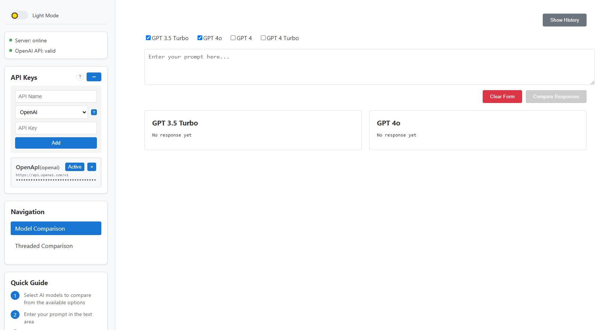
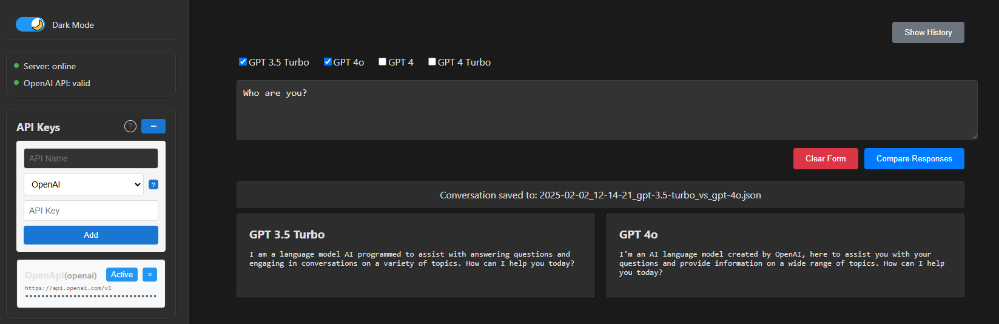

# AI Model Comparison Tool
Initially created in https://github.com/michalmietlinski/2025-simple-scripts/tree/main/simple-chat-model-comparision/chat-model-comparison
as a simple script to compare responses from different AI language models side by side, with support for both single-shot and threaded conversations.

Now expanding it into more complex tool with more features and better UI/UX.





## Features

### Current
- **Multi-Provider Support**
  - OpenAI (GPT-3.5, GPT-4)
  - DeepSeek (coming soon)
  - Anthropic (coming soon)
  - Custom API endpoint configuration

- **Conversation Modes**
  - Single-shot comparison
  - Threaded conversations
  - History tracking and management

- **Prompt Management**
  - Save and organize prompts
  - Import/Export prompt collections
  - Quick load functionality
  - Prompt descriptions and labels

- **UI/UX**
  - Dark/Light theme support
  - Responsive design
  - Grid/Stacked view options
  - Full-width toggle
  - Interactive help system

- **API Management**
  - Multiple API key management
  - Provider status monitoring
  - Custom endpoint configuration

### Coming Soon
- Enhanced provider support
  - Azure OpenAI
  - Google Gemini
  - Mistral AI
  - Local models (Ollama integration)
  
- Advanced features
  - Model parameter adjustment (temperature, etc.)
  
- Collaboration features
  - Export results

## Setup

1. Clone the repository:

2. Install dependencies:
```bash
npm install
```

3. Set up configuration:
```bash
cp config/apis.example.json config/apis.json
```

4. (Optional) Update `apis.json` with your API keys:
```json
{
  "apis": [
    {
      "id": 1234567890,
      "name": "OpenAI",
      "provider": "openai",
      "key": "your-api-key",
      "active": true
    }
  ]
}
```

5. Start the development server:
```bash
# Terminal 1 - Frontend
npm start

# Terminal 2 - Backend
npm run server
```

## Usage

1. **Model Selection**: Choose which AI models you want to compare
2. **Enter Prompt**: Type your prompt in the text area
3. **View Responses**: See responses side by side
4. **Thread Mode**: Continue conversations with context

## Contributing

This project is in active development. Contributions are welcome! Please check the issues page or create new ones for features and bugs.

### Development Plans

1. **Phase 1** (Current)
   - Basic model comparison
   - Thread support
   - Multi-provider groundwork
   - Dark/Light theme

2. **Phase 2** (Coming Soon)
   - New repository launch
   - Extended provider support
   - Advanced features
   - API improvements

## License

MIT License - See LICENSE file for details

## Acknowledgments

- OpenAI for their API
- React community for components and inspiration
- Contributors and testers

---
