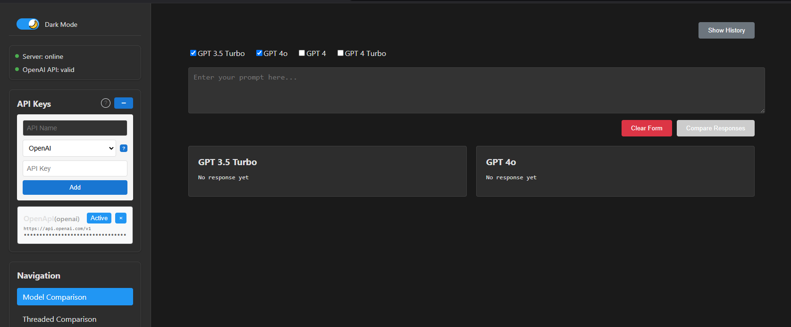

# AI Model Comparison Tool
A powerful tool for comparing responses from different AI language models in threaded conversations, with comprehensive prompt management and API configuration capabilities.

Initially created in https://github.com/michalmietlinski/2025-simple-scripts/tree/main/simple-chat-model-comparision/chat-model-comparison
and evolved into a more sophisticated application with enhanced features and improved UI/UX.





## Features

### Current
- **Multi-Provider Support**
  - OpenAI (GPT-3.5, GPT-4)
  - DeepSeek (coming soon)
  - Anthropic (coming soon)
  - Custom API endpoint configuration

- **Threaded Conversations**
  - Multi-model threaded chats
  - Persistent conversation history
  - Thread management and organization
  - Export conversation functionality

- **Prompt Management**
  - Save and organize prompts
  - Collections for prompt organization
  - Import/Export functionality
  - Quick load feature
  - Collection-based filtering

- **UI/UX**
  - Dark/Light theme support
  - Responsive design
  - Grid/Stacked view options
  - Full-width toggle
  - Interactive help system

- **API Management**
  - Multiple API key management
  - Provider status monitoring
  - Custom endpoint configuration

### Coming Soon
- Enhanced provider support
  - Azure OpenAI
  - Google Gemini
  - Mistral AI
  - Local models (Ollama integration)
  
- Advanced features
  - Model parameter adjustment (temperature, etc.)
  - Prompt templates and variables
  
- Collaboration features
  - Export results
  - Share collections

## Setup

1. Clone the repository:

2. Install dependencies:
```bash
npm install
```

3. Set up configuration:
```bash
cp config/apis.example.json config/apis.json
```

4. (Optional) Update `apis.json` with your API keys:
```json
{
  "apis": [
    {
      "id": 1234567890,
      "name": "OpenAI",
      "provider": "openai",
      "key": "your-api-key",
      "active": true
    }
  ]
}
```

5. Start the development server:
```bash
# Terminal 1 - Frontend
npm start

# Terminal 2 - Backend
npm run server
```

## Usage

1. **Model Selection**: Choose which AI models you want to compare
2. **Start a Thread**: Enter your initial prompt to begin a conversation
3. **Compare Responses**: View model responses side by side or stacked
4. **Continue Conversation**: Keep the context going with follow-up messages
5. **Manage Threads**: Save, load, and organize your conversation threads
6. **Collections**: Organize prompts into collections for better management

## Contributing

This project is in active development. Contributions are welcome! Please check the issues page or create new ones for features and bugs.

### Development Plans

1. **Phase 1** (Completed)
   - Threaded conversations
   - Multi-provider groundwork
   - Dark/Light theme
   - Prompt collections

2. **Phase 2** (In Progress)
   - Extended provider support
   - Advanced features
   - API improvements
   - Enhanced collection management

## License

MIT License - See LICENSE file for details

## Acknowledgments

- OpenAI for their API
- React community for components and inspiration
- Contributors and testers

---
