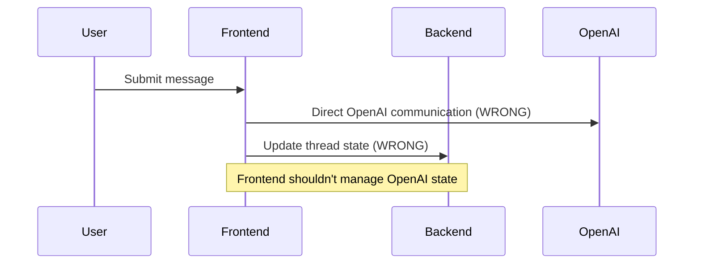
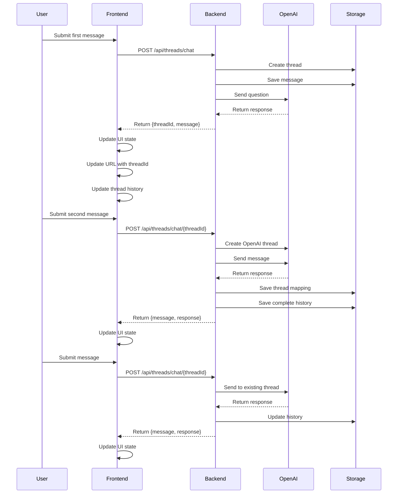

# Conversation Flow Analysis
Session ID: 20240320_ThreadConversationFlow

## Current vs Expected Implementation

### 1. Message Flow States

#### Current (Problematic) Implementation
- Frontend directly communicates with OpenAI (wrong)
- Thread mapping managed by frontend (wrong)
- Message history not properly persisted
- Unnecessary API calls and state updates

#### Expected Implementation
- Backend handles all OpenAI communication
- Backend manages thread mapping and persistence
- Complete message history maintained
- Optimized state updates and API calls

### 2. Data Flow Diagrams

#### Current Problematic Flow


#### Expected Correct Flow


### 3. Component Responsibilities

#### Frontend (React)
- User interaction
- URL management
- State management
  - Current conversation
  - Message display
  - Loading states
- API communication with backend only
- NO direct OpenAI interaction

#### Backend (Node/Express)
- API endpoints
- Thread management
  - Creation
  - Mapping
  - History
- OpenAI communication
- Data persistence
- Error handling

#### Storage Layer
- Complete message history
- Thread mappings
- State persistence
- Data validation

### 4. Data Structures

#### Thread Storage
```typescript
interface ThreadStorage {
  threadId: string;
  messages: Message[];
  openAIMapping?: {
    threadId: string;
    created: Date;
    lastUsed: Date;
  };
  metadata: {
    created: Date;
    updated: Date;
    messageCount: number;
  };
}
```

#### Message Storage
```typescript
interface Message {
  id: string;
  content: string;
  role: 'user' | 'assistant';
  timestamp: Date;
  threadId: string;
  order: number;
}
```

### 5. API Endpoints

#### Thread Management
```typescript
POST /api/threads/chat          // First message
POST /api/threads/chat/{id}     // Subsequent messages
GET /api/threads/{id}           // Get thread history
GET /api/threads               // List all threads
```

### 6. Error Handling

#### Critical Points
1. OpenAI Thread Creation
   - Retry logic
   - Fallback options
   - State recovery

2. Message Persistence
   - Transaction-like saves
   - Validation before save
   - Recovery mechanisms

3. State Synchronization
   - Version checking
   - Conflict resolution
   - History reconstruction

## Implementation Priorities

1. Backend Restructuring
   - Move OpenAI communication to backend
   - Implement proper thread management
   - Set up complete message persistence

2. Frontend Updates
   - Remove direct OpenAI communication
   - Update state management
   - Implement proper error handling

3. Data Layer
   - Implement complete history storage
   - Add validation
   - Set up proper error handling

4. Testing
   - Add unit tests
   - Integration tests
   - Error scenario testing

## Implementation Plan

### Phase 1: Backend API Restructuring
1. Update Thread Management
   ```typescript
   // src/server/routes/threads.ts
   POST /api/threads/chat
   - Create local thread
   - Send to OpenAI
   - Save response
   - Return {threadId, message, response}

   POST /api/threads/chat/{threadId}
   - Check message count
   - Create OpenAI thread if second message
   - Send to OpenAI
   - Save response
   - Return {message, response}
   ```

2. OpenAI Service Layer
   ```typescript
   // src/server/services/openai.ts
   class OpenAIService {
     async sendMessage(content: string, threadId?: string)
     async createThread()
     async getResponse(threadId: string)
   }
   ```

3. Storage Service Layer
   ```typescript
   // src/server/services/storage.ts
   class StorageService {
     async saveThread(thread: ThreadStorage)
     async saveMessage(message: Message)
     async getThread(threadId: string)
     async updateThreadMapping(threadId: string, openAIThreadId: string)
   }
   ```

### Phase 2: Frontend Updates
1. ThreadedComparison Component
   ```typescript
   // src/components/ThreadedComparison.tsx
   - Remove OpenAI direct communication
   - Update message handling
   - Implement proper loading states
   ```

2. Thread Service
   ```typescript
   // src/services/threadService.ts
   class ThreadService {
     async sendMessage(content: string, threadId?: string)
     async getThread(threadId: string)
     async listThreads()
   }
   ```

### Phase 3: Data Layer Implementation
1. Thread Storage Schema
   ```typescript
   interface Thread {
     id: string
     messages: Message[]
     openAIMapping?: {
       threadId: string
       created: Date
     }
     metadata: {
       messageCount: number
       lastUpdated: Date
     }
   }
   ```

2. File System Storage
   ```
   /threads
     /{threadId}
       - messages.json
       - metadata.json
   ```

### Phase 4: Error Handling & Recovery
1. OpenAI Error Handling
   ```typescript
   try {
     // OpenAI operations
   } catch (e) {
     if (e.code === 'thread_not_found') {
       // Recreate thread
     }
     // Other error handling
   }
   ```

2. State Recovery
   ```typescript
   class StateRecovery {
     async validateThreadState(threadId: string)
     async reconstructThread(threadId: string)
     async syncWithOpenAI(threadId: string)
   }
   ```

### Phase 5: Testing
1. Unit Tests
   - Message flow
   - Thread creation
   - Error handling

2. Integration Tests
   - Full conversation flow
   - State recovery
   - Error scenarios

## Implementation Order

1. Backend Changes
   - [ ] Update thread routes
   - [ ] Implement OpenAI service
   - [ ] Update storage service

2. Frontend Changes
   - [ ] Remove OpenAI direct calls
   - [ ] Update ThreadService
   - [ ] Update UI components

3. Testing & Validation
   - [ ] Add unit tests
   - [ ] Add integration tests
   - [ ] Manual testing

## Success Criteria
- All messages get OpenAI responses
- Thread creation on second message
- Complete message history maintained
- Proper error handling and recovery
- No direct OpenAI communication from frontend

## Next Steps

1. Update backend API endpoints
2. Modify frontend communication
3. Implement proper storage
4. Add comprehensive error handling

## Questions for Consideration

1. Should we implement message versioning?
2. How to handle failed OpenAI thread creation?
3. Should we add message queue for reliability?
4. How to handle state conflicts? 
